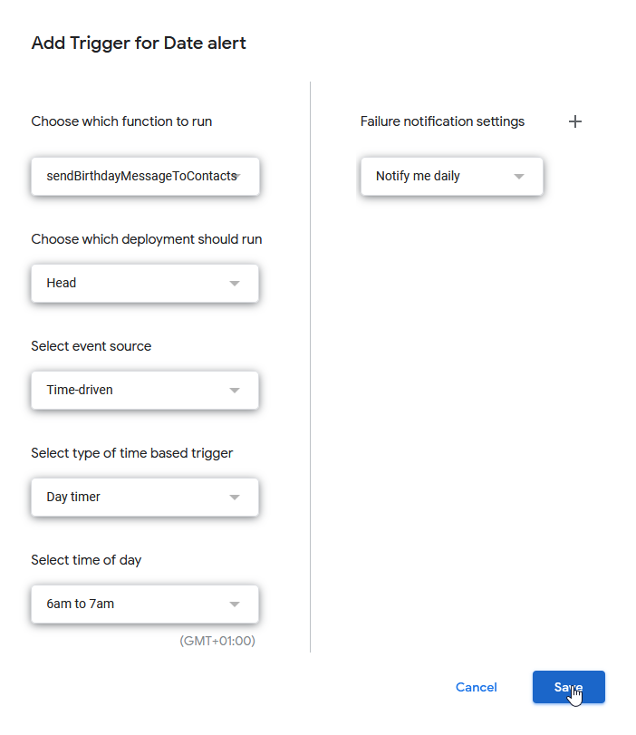

# description

This Google App script automatically sends a SMS or email to your contacts listed on a Google Sheet on their birthday.

If a phone number is defined, an SMS will be sent, otherwise an email will be sent if it is defined. If neither is defined or if sending fails you will be notified (by SMS or email) of their birthday.

/!\ emails will be sent from login used for your google account (not necessarily a gmail address by the way).

# setup

## create a Google Sheet with following format

| Firstname | Lastname | Phone Number | Email | Company | Note | Birth Date  | Message to send | Last Birthday message sent in |
| ---- | ---- | ---- | ---- | ---- | ---- | ---- | ---- | ---- |
| John | Wick | | john.wick@gmail.com | The Continental | brother in law | 02/09/1964  | Hi John | x |
| Alyssa | milano | 555-555 |  | | met in Vegas | 12/12/1972  | Hi Alyssa | x |

## Enable SmsGateway24

Create an account on [SmsGateway24](https://smsgateway24.com/register/)
Download the app on your smartphone https://smsgateway24.com/smsgateway24prolatest.apk (do not use Play store, the app is outdated).

*Free plan is limited to 1000 sms per month.*

## Fill required credentials

Check `.env.sample` to see required variables and their format.

Make a copy of the script `sheet-birthday.js` with all required values replaced.

## Add `sheet-birthday.js` as a bound script

copy this modified script `sheet-birthday.js` and paste it as a bound script for your Google Sheet (Tools > Script Editor).

Click play icon to run the script, then grant all required permissions.

## Make the script run every day

In Script editor, Edit > Current project's triggers.

Then create a new trigger (select function `sendBirthdayMessageToContacts`).

